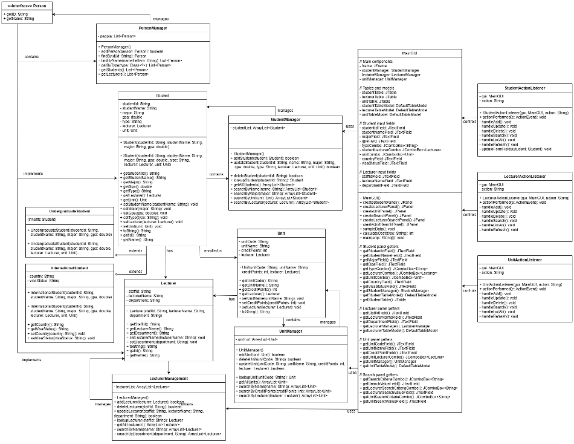

# Java Student Management GUI

## Overview

This is a Java desktop GUI application for managing students, lecturers, and units.

The project was developed to practise object-oriented programming concepts such as encapsulation, inheritance, polymorphism, abstraction, interfaces, class separation, and event handling.

The application uses Java Swing to provide a tab-based graphical user interface for managing university-related data.

---

## Features

- Add, update, delete, search, and list student records
- Manage lecturer information
- Manage unit information
- GUI-based operation using Java Swing
- Tabbed interface for Students, Lecturers, and Units
- Data display using `JTable`
- Input validation and feedback using dialogs
- Dynamic form fields for different student types
- In-memory data management during application runtime

---

## Object-Oriented Programming Concepts

### Encapsulation

The project uses private fields and public getter/setter methods to protect data and control access to class attributes.

Examples include:

- `Student`
- `Lecturer`
- `Unit`

### Inheritance

The project includes a class hierarchy for different student types.

- `Student` is the base class
- `UndergraduateStudent` extends `Student`
- `InternationalStudent` extends `Student`

### Polymorphism

The project uses a `Person` interface implemented by both `Student` and `Lecturer`.

This design allows different person-related objects to be handled through a common type and supports future extensibility.

### Abstraction

The project hides internal implementation details through manager classes and methods such as:

- `addStudent()`
- `searchStudent()`
- `calculateCost()`

This helps keep the code modular and easier to maintain.

---

## UML Class Diagram

The following UML class diagram shows the main structure of the application, including relationships between students, lecturers, units, manager classes, and action listener classes.

It also highlights the use of OOP concepts such as inheritance, interfaces, class separation, and event handling.



---

## Main Classes

| Class | Purpose |
|---|---|
| `MainGUI` | Builds the main graphical user interface |
| `Student` | Represents general student information |
| `UndergraduateStudent` | Represents undergraduate students |
| `InternationalStudent` | Represents international students |
| `Lecturer` | Represents lecturer information |
| `Unit` | Represents unit information |
| `StudentManager` | Manages student data |
| `LecturerManager` | Manages lecturer data |
| `UnitManager` | Manages unit data |
| `Person` | Interface for shared person-related behavior |
| `PersonManager` | Manages person objects for future extensibility |
| `StudentActionListener` | Handles student-related button actions |
| `LecturerActionListener` | Handles lecturer-related button actions |
| `UnitActionListener` | Handles unit-related button actions |

---

## Advanced Features

- International student fields appear dynamically when selected
- Tuition fee calculation based on student type
- Number formatting for tuition fees
- Multi-criteria search for students, lecturers, and units
- Separate ActionListener classes for cleaner event handling
- Sample data initialization for demonstration
- Tabbed layout using `JTabbedPane`

---

## Tech Stack

- Java
- Java Swing
- Object-Oriented Programming
- Event Handling
- Git / GitHub

---

## How to Run

1. Clone the repository:

```bash
git clone https://github.com/nkysd/java-student-management-gui.git
```

2. Open the project in your preferred Java IDE, such as IntelliJ IDEA, Eclipse, or VS Code.

3. Compile and run:

```bash
javac *.java
java MainGUI
```

---

## What I Learned

Through this project, I practised designing a Java application using object-oriented programming principles.

I also learned how to separate responsibilities across model classes, manager classes, GUI classes, and event listener classes to make the code easier to understand and maintain.
